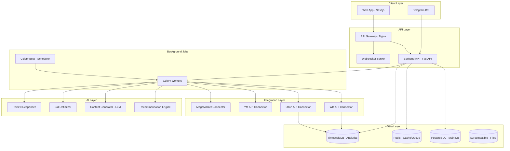

# Architecture: MarketFlow Platform
**Версия:** 1.0 | **Дата:** 2026-03-18
**Pattern:** Distributed Monolith (Monorepo) | **Infra:** VPS (AdminVPS/HOSTKEY) | **Deploy:** Docker Compose

---

## ARCHITECTURE OVERVIEW

### Style: Distributed Monolith

Единый репозиторий с несколькими сервисами, развёрнутыми через Docker Compose на VPS.
Выбор обоснован: команда небольшая (5-10 чел.), нет нужды в K8s overhead на старте, легко масштабировать горизонтально через несколько VPS.

---

## HIGH-LEVEL DIAGRAM



---

## COMPONENT BREAKDOWN

### 1. Frontend (Next.js 15 + Tailwind CSS)
- **SSR** для SEO (landing, blog)
- **CSR** для дашбордов (dynamic data)
- **PWA** для мобильного доступа без app store
- **Shadcn/ui** компоненты
- Реальное время через WebSocket (дашборд обновления)

### 2. Backend API (FastAPI + Python 3.12)
- REST API + WebSocket
- JWT аутентификация (python-jose)
- Rate limiting (Redis-based)
- OpenAPI-документация (автогенерация)
- Celery tasks для async операций

### 3. AI Layer
- **Recommendation Engine:** custom ML модель (CatBoost) на данных 100k+ SKU
- **Content Generator:** Anthropic Claude API (через MCP servers) для русскоязычного контента
- **Bid Optimizer:** правила + ML (gradient boosting на исторических bid/result данных)
- **Review Responder:** LLM с brand-voice fine-tuning

### 4. Data Layer
- **PostgreSQL:** основные данные (users, accounts, subscriptions, tasks)
- **TimescaleDB:** time-series данные продаж (партиционирование по дате и seller_id)
- **Redis:** кэш дашбордов (TTL 15 мин), очередь задач (Celery broker), сессии
- **S3 (MinIO self-hosted):** отчёты PDF, загруженные файлы, AI-генерированный контент

### 5. Integration Layer
- Каждый коннектор — изолированный модуль
- Exponential backoff при API ошибках
- Webhook receivers для realtime событий (WB/Ozon поддерживают)
- API key шифрование через Vault (HashiCorp Vault или AWS Secrets Manager equiv.)

### 6. Background Jobs (Celery)
- **data_sync:** каждые 15 минут — синхронизация данных из всех маркетплейсов
- **ai_recommendations:** каждый час — пересчёт рекомендаций
- **bid_optimizer:** каждые 30 минут — оптимизация ставок
- **report_generator:** по расписанию — ежедневные/еженедельные отчёты
- **review_monitor:** каждые 10 минут — мониторинг новых отзывов

---

## TECHNOLOGY STACK

| Layer | Technology | Version | Rationale |
|-------|------------|---------|-----------|
| **Frontend** | Next.js | 15.x | SSR + CSR гибрид, React экосистема |
| **UI** | Tailwind CSS + Shadcn/ui | latest | Быстрая разработка, accessible компоненты |
| **Backend** | FastAPI (Python) | 0.115.x | Async, typed, OpenAPI авто-генерация |
| **AI/ML** | Anthropic Claude API | claude-sonnet-4-6 | MCP integration, русский язык |
| **ML Custom** | CatBoost | 1.2.x | Ranking задачи (рекомендации), работает с категориальными |
| **Task Queue** | Celery + Redis | 5.3.x | Надёжная async обработка |
| **Primary DB** | PostgreSQL | 16.x | ACID, JSON поддержка, проверен |
| **Analytics DB** | TimescaleDB | 2.x | Time-series оптимизирован для метрик продаж |
| **Cache** | Redis | 7.x | Быстрый кэш + Celery broker |
| **File Storage** | MinIO (S3-compat) | latest | Self-hosted, данные в РФ |
| **Proxy** | Nginx | 1.25.x | Reverse proxy, SSL termination, load balancing |
| **Container** | Docker + Compose | 27.x | Простой деплой на VPS |
| **Monitoring** | Prometheus + Grafana | latest | Метрики + алерты |
| **Logging** | Loki + Grafana | latest | Centralized logs |
| **Secrets** | Docker Secrets + .env | — | Простое управление секретами для VPS |

---

## DATA ARCHITECTURE

### Core Entities

```sql
-- Users & Auth
users (id, email, password_hash, role, created_at)
sessions (id, user_id, token_hash, expires_at)
organizations (id, name, plan_tier, billing_info)

-- Marketplace Connections
marketplace_accounts (id, org_id, platform, api_key_encrypted, status)
connected_stores (id, account_id, store_name, store_id_on_platform)

-- Analytics (TimescaleDB)
sales_metrics (time, store_id, sku_id, platform, gmv, orders, views, conversion)
competitor_metrics (time, category_id, competitor_id, gmv, price, rating, reviews)
ad_metrics (time, store_id, campaign_id, spend, drr, clicks, orders)

-- AI Features
recommendations (id, store_id, type, action, est_impact_rub, status, created_at)
bid_rules (id, store_id, campaign_id, rule_type, params, enabled)
review_responses (id, review_id, draft, approved_at, sent_at)

-- Managed Services
managed_clients (id, org_id, account_manager_id, plan, contract_start)
managed_tasks (id, client_id, title, status, completed_at, impact_rub)
```

### Data Retention
- Real-time metrics: 90 дней (TimescaleDB)
- Aggregated metrics: 3 года
- User data: по истечении 30 дней после удаления аккаунта

---

## SECURITY ARCHITECTURE

### Authentication
- JWT tokens (access: 1h, refresh: 30d)
- TOTP 2FA (опционально, обязательно для enterprise)
- API keys для внешних интеграций (хранятся как hash)

### Data Protection
- API ключи маркетплейсов: шифрование AES-256 перед записью в БД
- TLS 1.3 для всех соединений
- Database: шифрование at rest
- Секреты: Docker Secrets (не в git, не в ENV переменных в открытом виде)

### Access Control
- RBAC: Owner, Admin, Analyst, Viewer (per organization)
- Row-level security в PostgreSQL
- Audit log: все API запросы логируются с user_id, timestamp, action

---

## DEPLOYMENT ARCHITECTURE

### VPS Configuration (AdminVPS/HOSTKEY)
```
Primary VPS (8 CPU, 32GB RAM, 500GB SSD):
  - nginx (proxy)
  - nextjs (frontend)
  - fastapi (backend, 4 workers)
  - celery workers (4 workers)
  - redis
  - postgresql + timescaledb

Storage VPS (separate):
  - minio (S3-compatible)
  - postgresql backup

Monitoring VPS (optional):
  - prometheus
  - grafana
  - loki
```

### Docker Compose Structure
```yaml
services:
  nginx: ...
  frontend: nextjs build
  backend: fastapi + uvicorn
  worker: celery worker
  beat: celery beat
  postgres: postgresql:16-alpine
  timescale: timescale/timescaledb:latest-pg16
  redis: redis:7-alpine
  minio: minio/minio
```

---

## MCP SERVERS INTEGRATION

```json
{
  "mcpServers": {
    "marketplace-data": {
      "description": "Access to marketplace analytics data",
      "tools": ["get_sales_metrics", "get_recommendations", "get_competitor_data"]
    },
    "ai-content": {
      "description": "AI content generation for listings",
      "tools": ["generate_description", "optimize_title", "generate_review_response"]
    }
  }
}
```

---

## SCALABILITY CONSIDERATIONS

### Horizontal Scaling
- Backend API: stateless → просто добавить инстансы за nginx upstream
- Celery workers: горизонтальное масштабирование через несколько VPS
- TimescaleDB: partitioning + read replicas при необходимости

### Bottlenecks (предсказуемые)
- AI recommendations: дорогие LLM вызовы → кэш результатов на 1 час
- Data sync: 15-минутный sync для 1000+ клиентов → distributed Celery queues
- TimescaleDB: при 10М+ строк/день → compression policy + continuous aggregates
