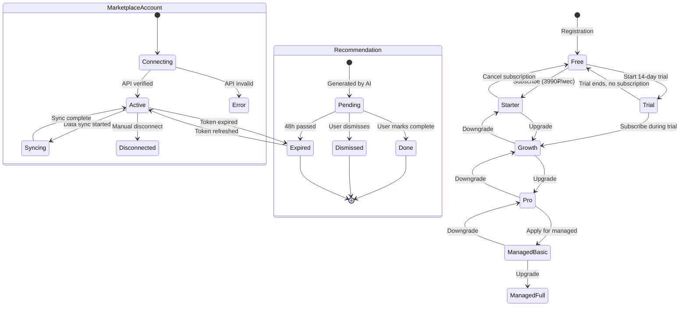

# Pseudocode: MarketFlow Platform
**Версия:** 1.0 | **Дата:** 2026-03-18

---

## DATA STRUCTURES

```typescript
// Core Entities
type Seller = {
  id: UUID
  org_id: UUID
  email: string
  role: 'owner' | 'admin' | 'analyst' | 'viewer'
  created_at: Timestamp
}

type MarketplaceAccount = {
  id: UUID
  org_id: UUID
  platform: 'wildberries' | 'ozon' | 'yandex_market' | 'megamarket'
  api_key_encrypted: string  // AES-256 encrypted
  status: 'active' | 'error' | 'expired'
  last_sync_at: Timestamp
}

type SalesMetric = {
  time: Timestamp          // TimescaleDB time dimension
  store_id: UUID
  sku_id: string
  platform: Platform
  gmv: number              // ₽
  orders: number
  views: number
  conversion: float        // views→orders ratio
}

type Recommendation = {
  id: UUID
  store_id: UUID
  type: 'pricing' | 'bid' | 'content' | 'inventory' | 'seo'
  action: string           // Human-readable action description
  action_params: JSON      // Machine-readable parameters
  est_impact_rub: number   // Estimated monthly revenue impact
  effort: 'easy' | 'medium' | 'hard'
  confidence: float        // 0.0-1.0
  status: 'pending' | 'done' | 'dismissed'
  expires_at: Timestamp    // Recommendations expire after 48 hours
  created_at: Timestamp
}

type BidRule = {
  id: UUID
  store_id: UUID
  campaign_id: string
  rule_type: 'target_drr' | 'max_bid' | 'time_based' | 'sku_level'
  params: JSON
  enabled: boolean
  last_applied_at: Timestamp
}
```

---

## CORE ALGORITHMS

### Algorithm 1: AI Recommendation Generator

```
FUNCTION generate_recommendations(store_id: UUID) -> List[Recommendation]

INPUT:
  - store_id: UUID
  - lookback_days: int = 30 (default)

PROCESS:
  1. FETCH recent_metrics = get_sales_metrics(store_id, last=30 days)
  2. FETCH competitor_metrics = get_competitor_data(store_id.categories, last=7 days)
  3. FETCH account_health = get_account_metrics(store_id)

  4. candidate_recommendations = []

  5. // Pricing opportunities
     FOR EACH sku IN recent_metrics:
       IF sku.conversion < category_avg_conversion * 0.7:
         IF sku.price > similar_skus_median_price * 0.95:
           impact = estimate_impact(sku, action='reduce_price', reduction=5%)
           IF impact > 10000:  // Only recommend if impact > 10k₽
             ADD Recommendation(type='pricing', action='Снизить цену SKU #{sku} на 5%', impact=impact)

       IF sku.gmv_rank < 10 AND sku.price < category_p75_price:
         impact = estimate_impact(sku, action='raise_price', increase=8%)
         ADD Recommendation(type='pricing', action='Повысить цену SKU #{sku} на 8%', impact=impact)

  6. // Bid optimization opportunities
     FOR EACH campaign IN account_health.campaigns:
       IF campaign.drr > target_drr * 1.2:
         action = 'Снизить ставки в кампании #{campaign} на 15% (ДРР превышает цель на 20%)'
         ADD Recommendation(type='bid', action=action, effort='easy')

       IF campaign.impressions < 100 AND campaign.bid < category_median_bid:
         ADD Recommendation(type='bid', action='Поднять ставки в кампании #{campaign}', effort='easy')

  7. // Content quality opportunities
     FOR EACH sku IN recent_metrics:
       content_score = calculate_content_score(sku)
       IF content_score < 70:
         ADD Recommendation(type='content', action='Улучшить карточку SKU #{sku} (балл: {score}/100)', effort='medium')

  8. // Rank by estimated impact
     candidate_recommendations.sort_by(est_impact_rub, descending=True)

  9. // Filter and limit
     final_recs = candidate_recommendations
       .filter(confidence > 0.6)
       .take(5)  // Max 5 recommendations per day

  10. SAVE to database
  11. SEND Telegram notification if user has alerts enabled

  RETURN final_recs

COMPLEXITY: O(n*m) where n=SKUs, m=categories
```

---

### Algorithm 2: Bid Optimizer

```
FUNCTION optimize_bids(store_id: UUID, campaign_id: string) -> List[BidAdjustment]

INPUT:
  - store_id: UUID
  - campaign_id: string
  - rules: List[BidRule]

PROCESS:
  1. current_bids = get_current_bids(campaign_id)
  2. recent_performance = get_campaign_metrics(campaign_id, last=7 days)
  3. active_rules = rules.filter(enabled=True, campaign_id=campaign_id)

  4. adjustments = []

  5. FOR EACH rule IN active_rules:

    IF rule.type == 'target_drr':
      target_drr = rule.params.target_drr
      current_drr = recent_performance.drr

      IF current_drr > target_drr * 1.05:  // 5% buffer
        reduction = min((current_drr - target_drr) / current_drr, 0.30)  // max 30% reduction
        new_bid = current_bid * (1 - reduction)
        adjustments.ADD(campaign_id, new_bid, reason='DRR превышает цель')

      ELIF current_drr < target_drr * 0.80:  // Underperforming, safe to increase
        increase = min((target_drr - current_drr) / target_drr * 0.5, 0.20)  // max 20% increase
        new_bid = current_bid * (1 + increase)
        adjustments.ADD(campaign_id, new_bid, reason='ДРР ниже цели, увеличиваем ставку')

    IF rule.type == 'time_based':
      current_hour = get_current_hour()
      IF current_hour IN rule.params.boost_hours:
        new_bid = current_bid * rule.params.boost_multiplier
        adjustments.ADD(campaign_id, new_bid, reason='Прайм-тайм буст')
      ELSE:
        new_bid = current_bid  // Reset to base

  6. // Apply adjustments (validate constraints)
     FOR EACH adj IN adjustments:
       adj.new_bid = clamp(adj.new_bid, rule.params.min_bid, rule.params.max_bid)

  7. APPLY adjustments via marketplace API
  8. LOG all changes to bid_adjustment_log
  9. IF any bid changed by > 20% THEN send Telegram alert

  RETURN adjustments
```

---

### Algorithm 3: X-Ray Audit Generator

```
FUNCTION generate_xray_audit(seller_id_on_platform: string, platform: Platform) -> AuditReport

INPUT:
  - seller_id_on_platform: string (public ID, no auth required)
  - platform: 'wildberries' | 'ozon'

PROCESS:
  1. // Fetch public data (no API key needed)
     listings = fetch_public_listings(seller_id_on_platform, platform, limit=10)
     IF listings.count == 0:
       RETURN Error('Магазин не найден или листингов нет')

  2. // Score each listing
     scored_listings = []
     FOR EACH listing IN listings:
       score = calculate_content_score(listing):
         // Content scoring formula:
         photo_score = min(listing.photo_count / 8, 1.0) * 25      // Max 25 points
         video_score = (1 if listing.has_video else 0) * 15         // 15 points
         desc_score = min(len(listing.description) / 500, 1.0) * 20 // 20 points (500 chars target)
         chars_score = min(listing.char_count / 15, 1.0) * 20       // 20 points (15 chars target)
         rating_score = (listing.rating / 5) * 20                   // 20 points

         total = photo_score + video_score + desc_score + chars_score + rating_score

       category_avg = get_category_avg_score(listing.category_id, platform)
       scored_listings.ADD({listing, score, category_avg, gap: category_avg - score})

  3. // Calculate revenue potential
     FOR EACH item IN scored_listings:
       IF item.gap > 0:
         // If score improved to category avg, estimate traffic increase
         traffic_lift_estimate = item.gap * 0.5  // 1 point = 0.5% traffic lift (conservative)
         revenue_potential = item.listing.gmv_estimate * traffic_lift_estimate / 100
         item.revenue_potential = revenue_potential

  4. // Identify top issues
     issues = []
     all_gaps = scored_listings.sort_by(gap, descending)
     FOR EACH item IN all_gaps[:3]:  // Top 3 issues
       issues.ADD({
         sku: item.listing.sku_id,
         issue: describe_issue(item),
         potential_impact: item.revenue_potential
       })

  5. BUILD report:
     {
       listings_analyzed: listings.count,
       avg_score: mean(scored_listings.scores),
       category_avg: category_avg,
       top_issues: issues,
       total_revenue_potential: sum(issues.potential_impact),
       generated_at: now(),
       expires_at: now() + 7 days,
       share_url: generate_share_url()
     }

  6. CACHE result for 24 hours (same seller_id + platform)

  RETURN report

COMPLEXITY: O(n) where n=listings count
NOTE: This endpoint is rate-limited to 3 requests/IP/hour to prevent abuse
```

---

## API CONTRACTS

### POST /api/v1/recommendations/generate
```
Request:
  Headers: { Authorization: Bearer <access_token> }
  Body: { store_id: UUID, force_refresh: boolean }

Response (200):
  {
    data: {
      recommendations: [
        {
          id: UUID,
          type: string,
          action: string,
          est_impact_rub: number,
          effort: string,
          confidence: float,
          expires_at: ISO8601
        }
      ],
      generated_at: ISO8601,
      next_update_at: ISO8601
    }
  }

Response (429 - Rate Limited):
  { error: { code: "rate_limited", message: "Рекомендации уже обновлялись менее часа назад", retry_after: 3600 } }
```

### POST /api/v1/audit/xray
```
Request:
  Headers: {} (no auth required)
  Body: { seller_id: string, platform: "wildberries"|"ozon" }

Response (200):
  {
    data: {
      listings_analyzed: number,
      avg_score: number,
      category_avg: number,
      top_issues: [{ sku, issue, potential_impact_rub }],
      total_potential_rub: number,
      share_url: string,
      expires_at: ISO8601
    }
  }

Response (404):
  { error: { code: "seller_not_found", message: "Магазин не найден" } }
```

### GET /api/v1/dashboard/overview
```
Request:
  Headers: { Authorization: Bearer <access_token> }
  Query: { store_id: UUID, period: "today"|"week"|"month"|"custom", date_from?: ISO8601, date_to?: ISO8601 }

Response (200):
  {
    data: {
      gmv_total: number,
      gmv_by_platform: { wildberries: number, ozon: number, ... },
      orders_total: number,
      avg_drr: number,
      top_skus: [{ sku_id, name, gmv, orders, trend }],
      gmv_trend: [{ date: ISO8601, gmv: number }]
    },
    meta: { cached_at: ISO8601, next_refresh: ISO8601 }
  }
```

---

## STATE TRANSITIONS



---

## ERROR HANDLING STRATEGY

```
GLOBAL EXCEPTION HANDLING:

1. MarketplaceAPIError:
   - 401: "Недействительный API ключ" → уведомить пользователя, приостановить sync
   - 429: Rate limit → exponential backoff (2s, 4s, 8s, 16s, max 3 retries)
   - 503: Маркетплейс недоступен → retry через 5 минут, логировать

2. DatabaseError:
   - Connection lost → retry 3 times, circuit breaker после 10 ошибок
   - Constraint violation → 409 Conflict с деталями

3. AIServiceError:
   - LLM timeout (>30s) → fallback to rule-based recommendation
   - LLM unavailable → queue for retry, не блокировать пользователя

4. ValidationError:
   - Bad input → 422 Unprocessable Entity с field-level errors

5. AuthError:
   - Expired token → 401 с refresh_required: true
   - Insufficient permissions → 403 с required_role
```
